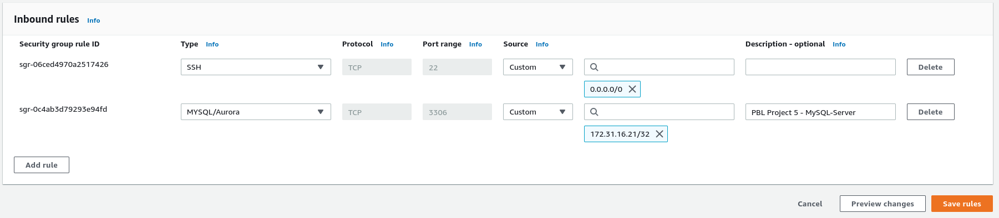
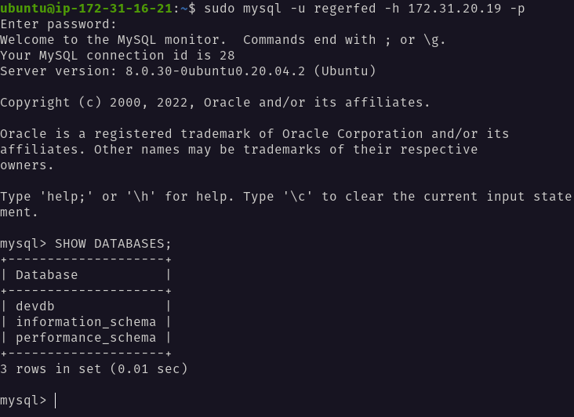

# Project 5 - Implement a Client-Server Architecture Using MySQL

- Create two EC2 instances. One named `mysql-server`, the other named `mysql-client`
    
- Update `apt` repository:
    ```
    sudo apt update
    ```
- Install MySQL Server Software: 
    ```
    sudo apt install mysql-server
    ``` 
- Open port `3306` on `mysql-server` by adding inbound rule in EC2. Allow access only to `mysql-client`:
    
- Edit the `mysqld.cnf` to configure MySQL to allow incoming remote connections:
    ```
    sudo vi /etc/mysql/mysql.conf.d/mysqld.cnf
    ```
- Find and change the `bind-address` value from `127.0.0.1` to `0.0.0.0`
- Remove insecure default setting with pre-installed security script. Start script: 
    ```
    sudo mysql_secure_installation
    ```
- Follow and respond to prompts to setup `root` password & other preferences.
- Login with `-p` flag to prompt for password and verify everything works well.
    ```
    sudo mysql -p
    ```
- Create a new role:
    ```
    CREATE ROLE 'developers';
    ```
- Create a new database:
    ```
    CREATE DATABASE 'devdb';
    ```
- Assign privileges to `devdb` for `developers` role:
    ```
    GRANT ALL PRIVILEGES ON devdb.* TO 'developers';
    FLUSH PRIVILEGES;
    ```
- Create new user and assign `developers` role:
    ```
    CREATE USER IF NOT EXISTS 'regerfed'@'%' IDENTIFIED WITH mysql_native_password BY 'mypass001' DEFAULT ROLE developers;
    ```
- Connect to `mysql-client` EC2 instance and install the MySQL Client software:
    ```
    sudo apt update
    sudo apt install mysql-client
    ```
- Connect to MySQL on `mysql-server` remotely:
    ```
    sudo mysql -u regerfed -h mysql-server-ip-address -p
    ```
    
